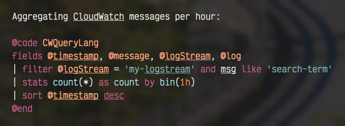

# CloudWatch-query

Provides syntax highlighting and a filetype for AWS CloudWatch Logs Insights Query Language.
While this syntax is mostly used on the AWS Console directly, I find it useful to save in files
(with a .cwl extension) for notes and future reference.

You may also see the syntax highlighting in code blocks for `.norg` files used by the Neorg notes
plugin.

Demo:



## Installation

Via the Lazy/etc plugin manager:

```lua
{ 'jfinnis/CloudWatch-query.nvim' }
```

Or copy the syntax file to `~/{NVIM_CONFIG}/after/syntax/cwl.vim`.
